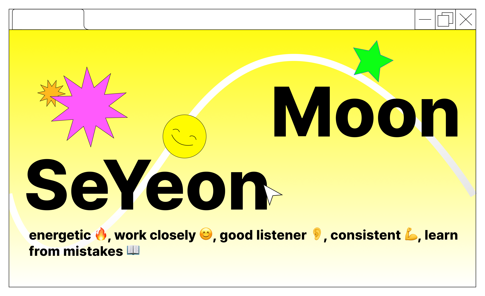

## Profile

>😊**안녕하세요, 백앤드 개발자 공부중인 문세연이라고 합니다. 제 깃허브를 방문해주셔서 감사합니다!**

---

### Contact Me 

**✉️Email |** lilylilyghost@gmail.com 
**🖥️Velog |** https://velog.io/@msylily/posts 
**📖Notion |** https://www.notion.so/23b279c66a864980afb749e0a0ef6d2c

<!--https://github.com/anuraghazra/github-readme-stats-->

### Tech Stacks 

         

### Most Used 

